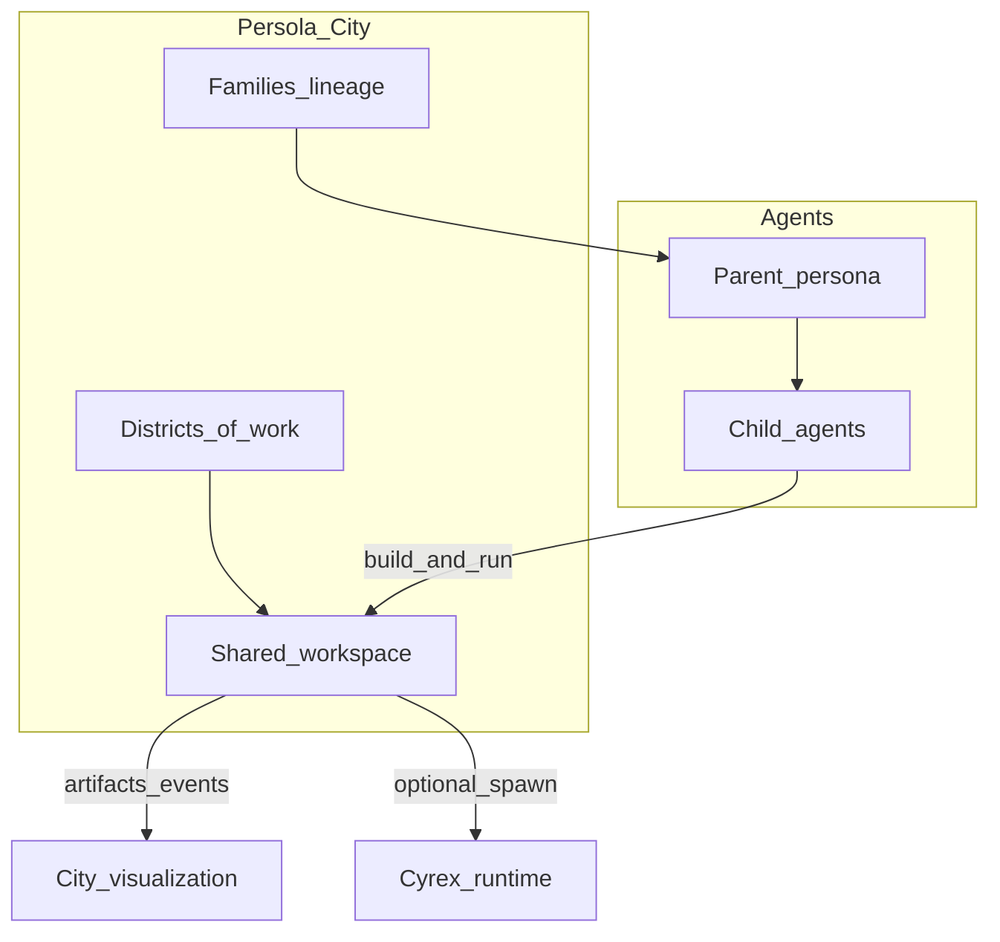
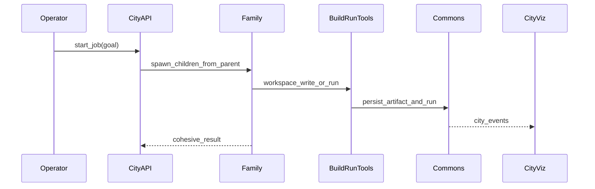

# Persola Communal City — Design Plan

**Status:** Draft  
**Audience:** Persola / Deepiri builders, Austin (visualization), Cyrex integrators  
**Related:** [COMMUNAL_CITY_ROADMAP.md](./COMMUNAL_CITY_ROADMAP.md)

---

## 1. Purpose

Persola is the **society layer** for Deepiri: a living city of cognitive agents with distinct personalities who form families, share tools, **build real artifacts, and run them**, while operators and visualizations observe the city at work.

This is not a chatbot factory and not a permanent five-role demo. It is an **agentic communal platform** where many agents execute cohesively.

---

## 2. Design principles

1. **Personality first** — Agents are not interchangeable workers. Knobs, presets, and blending define how they reason and collaborate.
2. **Families as cohesion** — Parent/child lineage is how agents inherit traits, tool scopes, and ownership of work.
3. **Build and run** — Agents must produce artifacts and execute approved tools, not only plan in chat.
4. **Shared commons** — A family shares one workspace for a job; cohesion comes from shared state, not private silos.
5. **Observable city** — Every spawn, write, run, and merge emits events for a living visualization.
6. **Society ≠ runtime** — Persola owns personality, family, and communal work. Cyrex remains the optional spawn/sync runtime when configured.

---

## 3. North-star experience

An operator (or demo host) can:

1. Seed a **parent persona** with a distinct personality.
2. Spawn a **family** of child agents (distinct knobs/roles, inherited tool tags).
3. Assign a **city job** with a goal (e.g. “build a small script and run it”).
4. Watch agents **write into the commons**, **run tools**, and merge results under a coordinator.
5. See the **city visualization** update: nodes (agents), edges (family), pulses (builds/runs).

At scale, the same model supports ~100 agents across districts (build, viz, research, ops), still organized as families sharing commons.

---

## 4. Capability lock: build and run

| Verb | Meaning |
|------|---------|
| **Build** | Write/update files, generate viz specs, produce code/docs/assets into the shared communal workspace |
| **Run** | Execute approved tools (tests, scripts, renderers) with concurrency limits, timeouts, and an audit trail |

Today’s default tool registry (`persola/orchestration/tools.py`) exposes memory/echo/delegate only. That registry is the extension point; city jobs register real `workspace_*` and sandboxed `run_*` handlers.

---

## 5. Mapping to existing Persola

| City concept | Existing foundation |
|--------------|---------------------|
| Distinct personalities | `persola/models.py`, `persola/engine.py` (knobs, blend, presets) |
| Small cohesive team | `persola/orchestration/team.py`, archetypes in `personalities.py` |
| Shared session memory | Team memory tables in `persola/db/models.py` |
| Parallel tool hooks | `ToolRegistry`, LangGraph runtime path |
| Operator UI | `ui/src/components/TeamWorkbench/` |
| Optional runtime sync | `persola/integrations/cyrex.py` |

**Gaps this design closes:** lineage/families, communal workspace (artifacts + runs), real build/run tools, scale/cohesion beyond five roles, city visualization surface.

---

## 6. Core primitives

### 6.1 Family (lineage)

- Graph of agents: parent → children.
- Children inherit knob deltas and allowed tool tags from the parent (with per-child overrides).
- Family is the unit of cohesion (“this family owns the viz district”).
- **Spawn** = create a child with inherited persona + scoped tools.

### 6.2 Commons (shared workspace)

- Versioned **artifacts**: `path`, content/blob, `created_by_agent_id`, `family_id`, timestamps.
- **Runs**: tool name, args, status, stdout/stderr, artifact refs, `started_by_agent_id`.
- All family members on a city job read/write the same commons.

### 6.3 City runtime

- **Job** = goal + family roster + district (`build` | `viz` | `research` | `ops`).
- Coordinator plans; executors invoke build/run tools (structured tool calls, not text-only plans).
- Cohesion rules: max concurrent agents, tool quotas, parent can veto/merge child outputs.
- Event stream feeds the city visualization.

---

## 7. System context

---

## 8. Job lifecycle

1. Operator creates or selects a family and starts a job with a goal.
2. City runtime ensures roster (parent + children) and opens/binds a commons.
3. Coordinator produces a delegation plan (reuse existing team router/archetypes).
4. Specialists call tools: `workspace_write`, `workspace_read`, `workspace_list`, `run_python`, `emit_viz_event`.
5. Each tool call persists artifacts/runs and emits `city_events`.
6. Parent/coordinator merges outputs into a final job result.
7. Visualization consumes the event stream.

---

## 9. Data model (logical)

| Entity | Role |
|--------|------|
| `families` | Named lineage root; owns default district / tool policy |
| `family_members` | Agent membership; `role_in_family` (`parent` \| `child`); inheritance metadata |
| `workspace_artifacts` | Files/blobs in the commons |
| `workspace_runs` | Execution audit trail |
| `city_jobs` | Goal, status, family, district, result summary |
| `city_events` | Append-only stream for UI / Austin viz |

Existing `team_sessions` / `team_workflows` remain for the current Team Workbench path. City jobs may reference a team session for orchestration continuity, but lineage and commons are first-class city entities.

---

## 10. API surface (design)

Namespace: `/api/v1/city/...`

| Area | Examples |
|------|----------|
| Families | create family, add/spawn member, get lineage graph |
| Jobs | start job, get status, list jobs |
| Commons | list/get artifacts, list runs |
| Events | list events (poll) / SSE or WebSocket stream |
| Viz contract | documented event payload for external visualizations |

---

## 11. Build/run tool contract

| Tool | Purpose | Safety |
|------|---------|--------|
| `workspace_write` | Create/update artifact in commons | Path sandbox under job workspace |
| `workspace_read` | Read artifact | Same sandbox |
| `workspace_list` | List paths | Same sandbox |
| `run_python` | Execute Python against commons | No network by default; timeout; output size cap |
| `emit_viz_event` | Push structured viz pulse | Validated schema only |

Executors must use **structured tool calls** wired through `TeamOrchestrator`, not only post-hoc `memory_store`.

---

## 12. Visualization contract (Austin)

Minimal event types the city emits:

| `event_type` | Payload highlights |
|--------------|--------------------|
| `agent.spawned` | agent_id, parent_id, family_id, role |
| `artifact.written` | path, agent_id, job_id, size |
| `run.started` / `run.finished` | tool, status, duration_ms, agent_id |
| `job.started` / `job.completed` | goal, family_id, status |
| `cohesion.merge` | parent_id, child_ids, summary |

UI wedge: graph (nodes = agents, edges = family) + live event feed. Austin may replace or extend the front-end; the event schema is the hand-off.

**Canonical contract:** [CITY_EVENTS.md](./CITY_EVENTS.md) — poll + SSE, payload catalog, graph mapping hints.

---

## 13. Non-goals (design boundary)

- Full multi-tenant SaaS “city hosting” on day one.
- Unrestricted shell or arbitrary network from agent tools.
- One hundred live LLM agents before the wedge proves build+run cohesion.
- Replacing Cyrex as the general agent runtime.

---

## 14. Success definition (design)

The design is validated when:

- A family can be spawned from a parent with visible lineage.
- A job causes at least one **artifact write** and one **run** in the commons.
- Events make who-built / who-ran observable in the city UI.
- Persola remains the society layer; Cyrex sync stays optional.

Implementation sequencing and milestones live in [COMMUNAL_CITY_ROADMAP.md](./COMMUNAL_CITY_ROADMAP.md).
